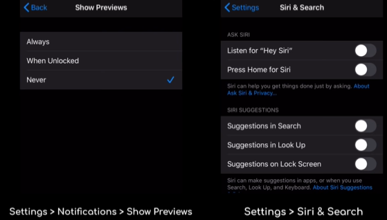

# IPhone-Security

Requirements 
1. Using Markdown
2. Complete all three zones for 
    each zone:
    * Complete all three most relevent tips    with steps to complete on your OS version
    * Also add the rational why you think these are the most inportant ones to include

## Green Zone Security

### Device Password
make sure your IPhone has a secure password so only you can get into your phone. 6-diget codes are the standard but if you want some extra security you can make a traditional password with numbers and letters by going to **Settings > Face ID and Passcode > Change Passcode > Passcode Options > Custom Alphanumeric Code.** this is to make sure nobody can get into your phone very easily.

### Notifications
By default your device will show your notifications in your lock screen. If you don't want these to be shown unless your phone is unlocked or not at all follow these steps

### VPN
It is highly recommended that you invest in a Virtual Private Network (VPN) if you frequently use open WIFI connections from places like stores, restaurants, and even your workplace. as for what VPN to get I would recommend watching this video [Here](https://www.youtube.com/watch?v=xEzbKNBVyZM&t=0s) to figure out what VPN you might want.

## Yellow Zone Security 
### Bluetooth
It is reccomended that you disable bluetooth at all times unless your using some sort of device with it like headphones. this will ensure that nobody will be able to connect to your phone with bluetooth while your in public. to do this you will need to go to **Settings > Bluetooth** and switch off the bluetooth option.

### GPS
It is also recommended that you turn off your GPS location when not in use because it is activly tracking your phone. to do this go to **Settings > Privacy > Location services**. while your there you might as well go through what apps can have access to your GPS and disable the ones you don't need your GPS on.

### Privacy Screen Protector
If you're frequently in public areas and don't want strangers to see your screen you should also invest in a Privacy Screen that will black out your screen at certin angles so you won't have to worry about others snooping on what your doing on your phone 
## Red Zone Security

### Cellular Provider
Your cellular provider will pretty much always know where you are. If this is an issue for you, you should look into a pre-paid cellular subscription because they require little information from you and all payment is upfront.

### Camera
If you're really paranoid about your camera there are ways to remove the chip in them to eliminate risk, however the this may prove difficult depending on your IPhone as newer ones have anti-repair systems. If you are dead set on doing this I would advise you reasearch more on the subject.

### Logging out of ICloud
If the only thing you need is your phone to work with calls and not anything else you can log out of your ICloud. You might want this option if you want as little information of you as possible available. to do this simpily go to **Settings > Apple ID > Sign Out**. When you do this you will no longer be able to use the App Store, ITunes, ICloud, or IMessage however.